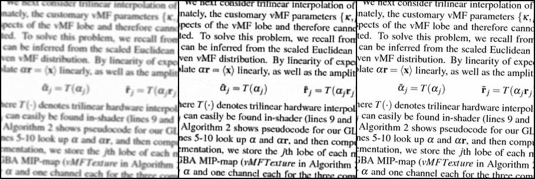
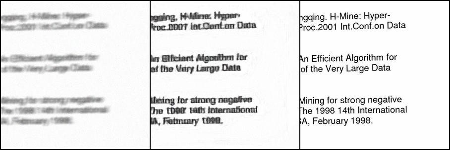
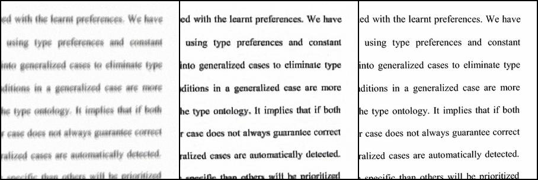
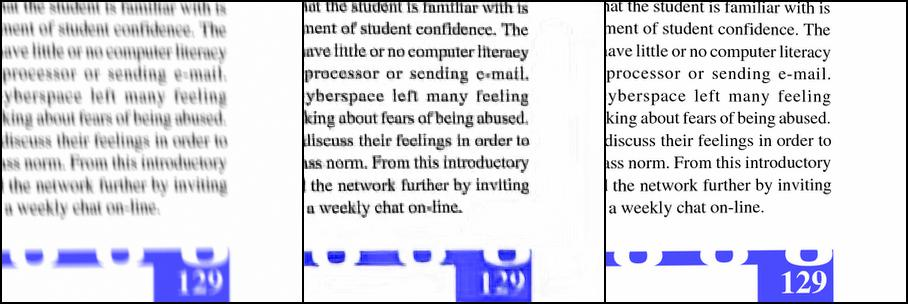
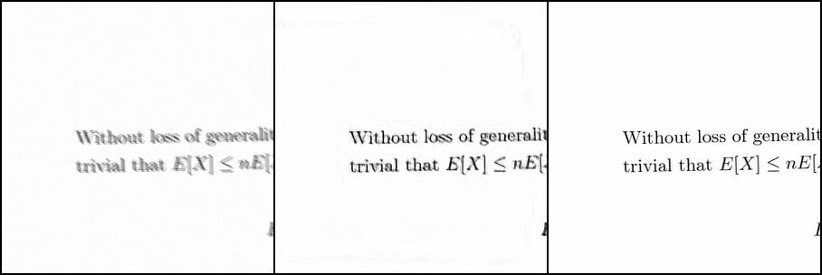
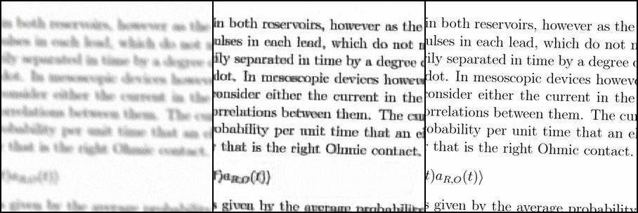
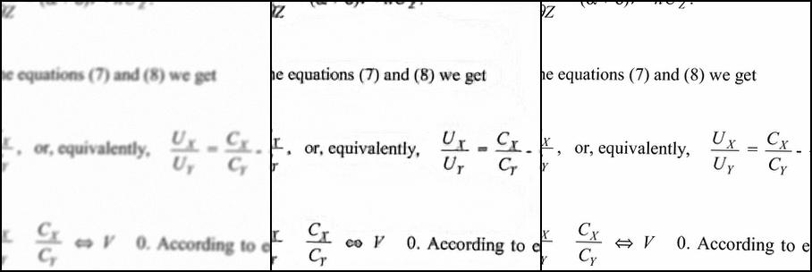
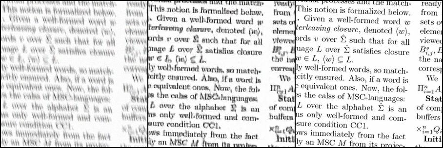

# Reducing the blurring noise of text images by Convolutional Neural Networks

## Contributors

- [huizhang0110](https://github.com/huizhang0110)

## Project Goal

## Datasets

- [dataset](http://www.fit.vutbr.cz/~ihradis/CNN-Deblur/)

## Results

## Reference

- [Convolutional Neural Networks for Direct Text Deblurring](http://www.fit.vutbr.cz/~ihradis/CNN-Deblur/)
